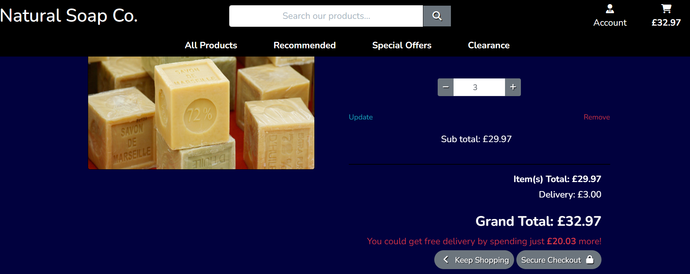
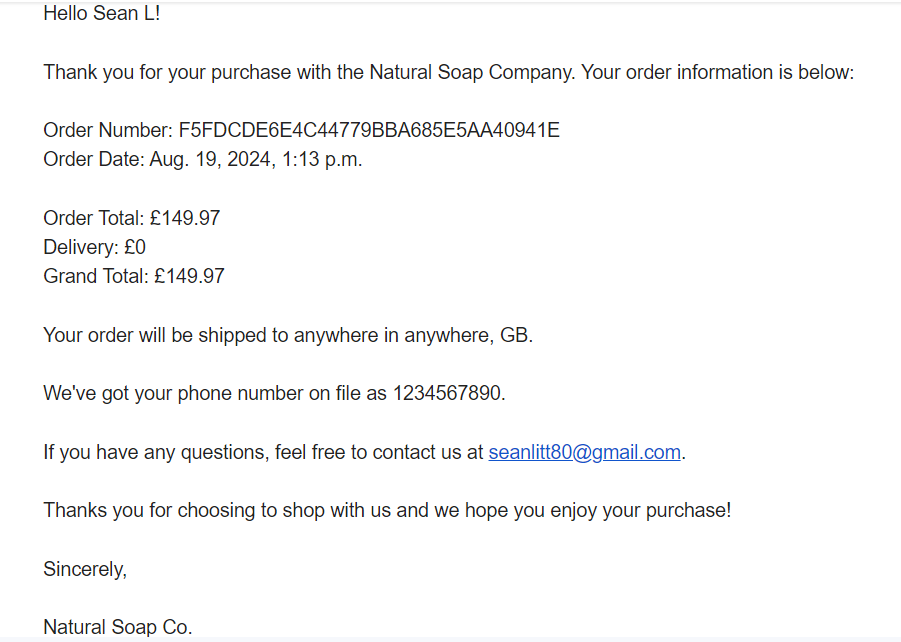

# Natural Soap Company

[Link to Natural Soap Co. live site](https://natural-soap-company-v1-33f8559d9f2f.herokuapp.com/)

This is my Milestone 4 project based around a fictional company.
The Natural Soap Company is a newly formed company with the aim of selling soaps free from harmful chemicals to customers of all ages who think like us on how soap should be made. It's website has been created using a postgreSQL database. It's made using lanuages like JavaScript and Python. Bootstrap has been used for a structured layout and Stripe used for payments.

## Developer goals

As a Developer, I would like:
- to build a website which is easy to navigate through and use.
- to make the user able to have their own profile for when they use the website.
- to allow users the ability to create, display, edit and delete reviews.
- develop a database structure which will allow for previous orders, wishlists, delivery info to be stored securely.
- for superusers to be able to create, display, edit and delete products to sell.

## User stories

As a user of this website, I want:
- to browse products easily without the need to sign in.
- to add items to my cart to see how much everything I wanted would cost.
- to be able to read reviews on the products before I buy them.
- to feel that your website is secure.
- the sign up process to be easy to understand.
- acknowledgement that I have made an account with you.
- the buying process to be quick and straight forward.
- acknowledgement that I have made a purchase from you.
- to be able to view my past orders.
- to be able to ammend my details if needed.
- to be able to make a list of items I would like to buy in the future.

---

## Design choices

The basic colour range for this website are with the following colours :

-  `#ffffff`
-  `#000000`
-  `#6c757d`
-  `#ff007b`
-  `#01013e`

I felt these were a vibrant contrast to my beige background picture.
Originally I had my home page background picture displayed throughout the website but, especially with the pages that had images, I felt this clashed with my content so decided to go for a dark plain colour so I could let my content stand out more cleanly. 
I felt the rounded edges of the buttons and lowercase within the buttons felt more relaxed like the products.
The toasts I kept a white background on so they would stand out as I have a timer for how long they appear for.

---

## Wireframes

[Wireframes](https://github.com/Seanl80/natural_soap_company_v1/blob/main/docs/wireframes/All-wireframes.pdf)

Here are the original wireframes:
I have made the nine main pages of the site.
- The <strong>Home page</strong> consists of an explanation of the site with navigation and shop now button. There will be icons in the navbar to <strong>login/register</strong> and a basket total.
- The <strong>Products page</strong> will consist of rectangler cards showing the different products with their images and prices.
- The <strong>Product details</strong> page will show a larger image and a more in depth description with a review section below.
- The <strong>Wishlist page</strong> will show rectangular cards again with image and price with buttons to remove from wishlist or go to product details page.
- The <strong>Basket page</strong> will contain a large image, product info and clear pricing and a total. There is buttons to make a choice whether to buy and go to checkout or to continue shopping.
- The <strong>Checkout page</strong> will be a similar layout to the basket page but will ask for customer details and a permission check to store this info.
- The <strong>Checkout success page</strong> will consist of an order confirmation the order was successful stating what was bought.
- The <strong>Register page</strong> will be the base for all form pages with content being centered with white input boxes clearly labelled.
- The <strong>Sign in page</strong> will be the base for my sign out page to keep things consistent again with clearly labelled white input boxes.

---

## Technologies used

For this website I have chosen to use: 
- <strong>HTML</strong>, <strong>CSS</strong> and <strong>JavaScript</strong>
- <strong>Python</strong> and <strong>Postgresql</strong>

As well as:
- [Bootstrap](https://getbootstrap.com/) for structure and layout
- [FontAwesome](https://fontawesome.com/) for icons
- [Stripe](https://stripe.com/gb) for payments
- [Gitpod](https://www.gitpod.io/) for writing code
- [GitHub](https://github.com/) for code storage
- [Heroku](https://www.heroku.com) for deployment
- [AWS](https://aws.amazon.com/) for media storage

---

## Testing Developer Goals

As a Developer, I would like:
1. to build a website which is easy to navigate through and use.
- I feel I achieved this by firstly having the big show now will leads directly to all products. The different categories are highlighted on hover and each product and page have clear navigation routes forwards and back.
2. to make the user able to have their own profile for when they use the website.
- I felt I wanted first time customers to be able to wander and navigate through the website without the pressure of having to make an account. The account icon stands out in the navbar with a simple process of creating an account. Users then experience the benefit of creating an accountas they can create a personal wishlist and have details saved when buying products for quicker checkout in the future.
3. to allow users the ability to create, display, edit and delete reviews.
- users when signed in can create, edit or delete their reviews they made on all products. Only superusers have the ability to edit or delete evry review made.
4. develop a database structure which will allow for previous orders, wishlists, delivery info to be stored securely.
- if a customer has signed in then this can be achieved by selecting the Account icon then My Profile for delivery info and past orders. Selecting the Account icon then Wishlist will allow customer to create and view a list of products they maybe interested in purchasing in the future.
5. for superusers to be able to create, display, edit and delete products to sell.
- this has been achieved as superusers have the ability to edit or delete all reviews as well as creating there own.

## Testing User Stories

As a user of this website, I want:
1. to browse products easily without the need to sign in.
- from the home page you can jump straight into view products either from the shop now button or choosing a category.

2. to add items to my cart to see how much everything I wanted would cost.
- the cart structure is easy to understand and see how much your grand total would be.

3. to be able to read reviews on the products before I buy them.
- on each product detail page a review section has been added to allow users to read reviews before buying them with or without signing in.

4. to feel that your website is secure.
- on my toast pop up and the checkout screen I felt it was important to use the word secure to put users at ease of potential fears.

5. the sign up process to be easy to understand.
- everything here is labelled and navigation clear to understand. If corrections are needed its stated clearly.

6. acknowledgement that I have made an account with you.
- users will recieve a confirmation email after a sign up which will require user to verify their email by clicking the provided link.

7. the buying process to be quick and straight forward.
- after viewing the cart its just a case of filling out details (if you are a new user) if not details can be saved and boxes prepopulated. Then it is one more button click for the purchase. You can also click directly from the toast pop up but it points to the cart icon if you don't click on the toast button this is again to aid with navigation.

8. acknowledgement that I have made a purchase from you.
- there is two confirmations. Firstly on screen you will see an order confirmation stating what you have bought and the price you have been charged. Then secondly customer will recieve an email with the same info of what has been bought and how much was paid.

9. to be able to ammend my details and to be able to view my past orders.
- thi can be done easily from the My Profile screen where details are stored and past orders are listed and can be clicked to view full details.

10. to be able to make a list of items I would like to buy in the future.
- the wishlist is a great way for product short cuts and to keep potential buys in a personal space for future use.

---

## Testing

I have used these validators to check the validity of my code.

- [W3C CSS Validation](https://jigsaw.w3.org/css-validator/)
    - no errors or warnings
- [W3C Markup Validation](https://validator.w3.org/)
    - no errors or warnings
- [JShint JavaScript Validation](https://jshint.com/)  
    - no errors but one undefined variable which is Stripe
- [CI Python Linter Validation](https://pep8ci.herokuapp.com/)  
    - no errors or warnings

---

## Bugs

I did stumble into a few problems of my own doing most of the time. These didn't really come to light until I started to test the responsiveness of the site. For example the navbar responsiveness was great until 420 width then the alignment all went out. I added a media query to fix this and to lessen my hero text top padding for better visual effect. I also found my quantity box in my product details was affected to because of the layout so another media query was added for that.
I also found that when my bag was empty the footer was jumping inside my div that contained the text. So I had to change the position to fixed from static to fix that.

However this meant on smaller screen some of my bottom content could not be seen so padding had to be added. After creating the product pages I felt having the home page background was too much so I went for a plain color to help the content stand but because of the design of the picture I could't see that I had put the image inside the body and overlay. This was overcome by removing it from the body and renaming the overlay class on my homepage to include the picture rather than going through all my pages to remove the overlay.

## Deployment

This project was developed using the [Gitpod IDE](https://https://gitpod.io/). Then developments and changes were commited and pushed to GitHub. Heroku was used to deploy this website and AWS used to hold the media files.

To clone this project into Gitpod you will need:

1. A GitHub account. [Create a GitHub account here](https://www.github.com).
2. Use the Chrome browser.

Then follow these steps:

1. Install the Gitpod Browser Extensons for Chrome.
2. After installation restart the browser.
3. Log into Gitpod with your Gitpod account.
4. Navigate to the Project GitHub repository.
5. Click the green "Gitpod" button in the top right of the repository.
6. This will trigger a new gitpod workspace to be created from the code in github where you can work locally.

To deploy this page from Heroku, the following steps were taken:

1. Create a Heroku Account and log in. Click 'New' -> 'Create new app'
2. Enter a name for your project and select your region
3. Click 'Create app'
4. Navigate to PostgreSQL from Code Institute and enter your email
5. Update your project with the URL sent to your email
6. Make sure to have dj_database_url and psycopg2 installed
7. Login to the Heroku CLI - `heroku login -i`
8. Run migrations on Heroku Postgres - `python3 manage.py migrate`
9. Create a superuser - `python3 manage.py createsuperuser`
10. Install gunicorn - `pip3 install gunicorn`
11. Create a requirements.txt file - `pip3 freeze > requirements.txt`
12. Create a Procfile
13. Disable Heroku from collecting static files
14. Add the hostname to project settings.py file
14. Commit and push the changes to GitHub
15. Go to 'Heroku Settings', click 'Reveal Config Vars'
16. The following variables were added:
- AWS_ACCESS_KEY_ID
- AWS_SECRET_ACCESS_KEY
- DATABASE_URL
- EMAIL_HOST_PASS
- EMAIL_HOST_USER
- SECRET_KEY
- STRIPE_PUBLIC_KEY
- STRIPE_SECRET_KEY
- STRIPE_WH_SECRET
- USE_AWS
17. Click on the 'Deploy' tab.
18. Click 'Connect to GitHub'
19. Find your repo and click 'Connect'
20. Click 'Enable Automatic Deploys'
21. Up to date version of App is now deployed by pushing to GitHub
22. Click 'Open App'

### AWS S3 Bucket Set-up

1. Create an [Amazon AWS account](https://aws.amazon.com/)
2. Search for S3 in the search bar and create a new bucket
3. To create the new bucket follow these steps:
        Enter a bucket name
        Select 'ACLs enabled'
        Select 'Bucket owner preferred'
        Deselect 'Block all public access'
        Check the box to acknowledge the risk of public access
        Leave the other options unchanged and click 'create bucket'
4. Click bucket name then click 'Properties' tab 
5. Scroll down to static web hosting click 'Edit' and enable them
6. Save your changes then click 'Permissions' tab
7. Scroll down to the Cross-origin resource sharing (CORS) section and click 'Edit'
8. Add the following code and save changes 
        `[
        {
            "AllowedHeaders": ["Authorization"],
            "AllowedMethods": ["GET"],
            "AllowedOrigins": ["*"],
            "ExposeHeaders": []
        }
        ]`
9. On the 'Permissions' tab of your S3 bucket, scroll to the 'Bucket policy' section
10. Click 'Edit' then click 'Policy Generator', this will open in a new tab
11. When entering info:
        For the policy type you can select 'S3 Bucket Policy'
        For the principal you can enter `*`
        For the Action select GetObject' from the dropdown
12. Go back copy the ARN and paste it into the ARN input
13. Click add statement then generate policy
14. Copy all the JSON text and paste it into the bucket policy
15. Add `/*` to the end of the resource line within the quotes, to allow access to all objects within the bucket
16. Save your changes
17. Click on the 'Permissions' tab, scroll down to the Access control list section and click 'Edit'
18. On the 'Edit Access control list' page: 
        Click 'List' in the Everyone (public access)
        Click the checkbox to indicate that you understand the effects of the changes
        Click 'Save changes'

### AWS IAM (Identity and Access Management) setup

1. Search for IAM in the search bar
2. Click on 'User Groups' in the left list
3. Click 'Create', name it then scroll down and click 'Create User Group'
4. Click 'Policies' in the menu to the left and click 'Create policy'
5. After clicking the 'JSON' tab from the dropdown 'Actions' menu select 'Import policy'
6. Search for 'S3', then select 'AmazonS3FullAccess', then click 'Import Policy'
7. Search for 'S3' in the top search bar and open it in a new tab
8. Select your bucket then click 'Copy ARN'
9. In the policy editor within 'Resources' and square brackets paste the arn twice adding `/*` to the end of the second arn
10. Click next, enter a policy name and description then click 'Create policy'
11. Click 'User groups' in the menu to the left then click on your group
12. Click the on the 'Permissions' tab and from the 'Add permissions' dropdown click 'Attach policies'
13. Select the checkbox beside your policy and click 'Attach policies'
14. Select 'Users' in the left menu and click 'Create user'
15. Enter a user name then click 'Next'
16. Select the group you have created click 'Next' then click 'Create user'
17. To create an access key click on the new user
18. Click 'Security credentials' tab
19. Scroll down to the 'Access keys' section and click 'Create access key'
20. Select application running outside AWS, click 'Next' then click 'Create access key'
21. Download the CSV file then click 'Done' to finish the process
22. The CSV file will contain your access key ID and the secret key values for heroku

---

## Credits

My thanks go out to the tutors at Code Institute, my mentor Harry and also Code Institute for providing me a knowledge base to be able to do a project like this.

### Code

The Code Institiue student template was used to create this project.

This project has used code from the Boutique Ado walkthrough as the basic structure then embellished.

### Media

- For my images I used [Pixabay](https://www.pixabay.com/).
- For my favicon image I used [Icon Archive](https://www.iconarchive.com/).
- To show my website on different screens I used [Am I responsive](https://ui.dev/amiresponsive/) to create them.
- For my wireframes I used [Balsamiq](https://balsamiq.com/).